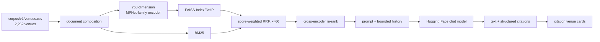

Demo video of chatbot using LLM and Jev combination:

https://github.com/user-attachments/assets/1e8ee742-8aa2-4d57-b660-cb75993a7c68

# Urban Gala

Urban Gala is a Manhattan venue-discovery and itinerary application built with
React, Spring Boot, Flask, MySQL, and local ML artifacts. Users can search by
natural-language “vibe,” inspect predicted busyness, plan routes, save and share
plans with friends, and ask a retrieval-grounded AI concierge for venue
recommendations.

## Verified capabilities

- Browse a canonical catalog of 2,262 Manhattan venues.
- View current-time busyness predictions and a 12-hour forecast.
- Search venues using normalized FAISS dense retrieval with zone and price
  filters.
- Use BM25+dense hybrid retrieval through Reciprocal Rank Fusion.
- Ask an AI concierge that receives retrieved venue context and returns
  structured citation records.
- Continue conversations with bounded prior questions and responses.
- Hydrate cited venues into frontend cards and add them to an itinerary.
- Request walking or transit routes through Google Routes, with route
  normalization, segment caching, and fallback polylines.
- Create, edit, save, and share plans with selected users/friends.
- Manage favorites, friends, profiles, and avatars through JWT-authenticated
  APIs.

“Current” or “live” busyness is model inference for the current time and
available weather inputs. It is not sensor-based live occupancy.

## Architecture

| Service | Responsibility |
|---------|----------------|
| `frontend` | React/Vite interface; production bundle served by Nginx |
| `backend` | Spring API for auth, users, venues, plans, favorites, friends, routing coordination, caching, and service contracts |
| `llm-service` | Flask/Gunicorn service for FAISS, BM25, RAG orchestration, citations, evaluation, and metrics |
| `busyness-service` | Flask service for Keras DNN/LSTM prediction, forecasts, artifact verification, and bounded caches |
| `db` | MySQL schema managed by Flyway and validated by Hibernate |

### RAG path



The cross-encoder is enabled in Compose (`CROSS_ENCODER_ENABLED=true`). Jev
re-ranking is off. On the committed 96-question rerank reports, hybrid
retrieval with no reranker is Recall@5 0.4493 at a median of 22.5 ms, and the
cross-encoder is 0.4899 at 57.8 ms. Jev re-ranking scored 0.4889 at a median
of 888 ms, which is why it stays off the request path. Re-ranking text also
gets canonical `Area:` labels, so a micro-zone such as Lenox Hill is visible
to the cross-encoder as the Upper East Side.

With `JEV_ENABLED=true` and query analysis left off, three Jev decisions still
run: a pre-retrieval scope cap, calibrated abstention, and a tiered
faithfulness guardrail. Each one fails open if TypeSafe is unavailable.

The generative LLM runs through the Hugging Face chat-completions API. It is not
hosted locally by this repository.

## Evaluation

The offline harness uses a 96-question benchmark across five categories and
computes Recall@5, NDCG@5, MRR, Precision@5, and Hit Rate. A Jev judge then
scores faithfulness, answer relevancy, and context precision. The release pass
in `BackEnd/llm-service/reports/ragas-v2.json` scored 96/96 questions with 0
judge failures: faithfulness 0.4069, answer relevancy 0.7225, context precision
0.6852.

These results are directional measurements on a small internal benchmark, not a
claim of production relevance quality. The score files live under
`BackEnd/llm-service/reports/`.

## Documentation

Long-form design notes are not tracked. Local notes, including the demo
script, can live in `.docs/` (gitignored). Contract fixtures remain at
`BackEnd/contract-fixtures/README.md`. Evaluation artifacts are under
`BackEnd/llm-service/reports/`.

Files under `Organisation/` and `ModelExplain.ipynb` are historical project
artifacts. Model-directory READMEs are upstream model cards.

## Requirements

- Docker Desktop with Compose
- Git LFS
- A populated root `.env`, based on `env.example`
- Google Routes credentials for route functionality
- A Hugging Face token for generated chat responses

Required production secrets include:

```text
MYSQL_ROOT_PASSWORD
MYSQL_PASSWORD
APP_JWT_SECRET
HF_TOKEN
VITE_GOOGLE_API_KEY
```

The browser-visible Google key must be restricted by HTTP referrer and API in
Google Cloud Console.

## Start the stack

```bash
git lfs install
git lfs pull
cp env.example .env
./scripts/verify-artifacts.sh
docker compose up --build
```

Default host endpoints:

| Endpoint | Address |
|----------|---------|
| Frontend development service | `http://localhost:5173` |
| Spring API | `http://localhost:8080` |
| MySQL host mapping | `localhost:3307` |
| Production Nginx profile | `http://localhost:80` |

`llm-service` and `busyness-service` are on the compose network. Use
`docker compose exec` for in-network health probes.

```bash
docker compose exec llm-service curl -f http://localhost:5000/health
docker compose exec busyness-service curl -f http://localhost:5000/health
```

Reset the development database when migrations or baseline data change:

```bash
docker compose down -v
docker compose up -d db backend
```

## Verification

Run individual suites:

```bash
cd BackEnd && ./mvnw test
cd frontend && npm test -- --run
cd BackEnd/llm-service && PYTHONPATH=. python3 -m pytest tests/ -q
cd BackEnd/busyness-service && PYTHONPATH=. python3 -m pytest tests/ -q
```

Run the production-style smoke check when Docker is available:

```bash
bash scripts/compose-smoke.sh --teardown
```

As of 2026-09-23 on the `jev` branch, the LLM pytest suite passes
(562 passed, 32 skipped) and the busyness suite passes (20 passed, 1 skipped).

## Operational qualifications

- All caches are process-local, JVM-local, or browser-local; there is no Redis.
- Spring rate limits are per JVM and reset on restart.
- TLS termination, MySQL TLS, CSP headers, non-root containers, and distributed
  rate limiting are not implemented in this repository.
- The Nginx production bundle emits a large-chunk warning; code splitting is a
  remaining optimization.
- Prometheus metrics and a provisioned Grafana dashboard are included in the
  current v2 Compose configuration.
- Plans are shared with selected users, not through public shareable links.
