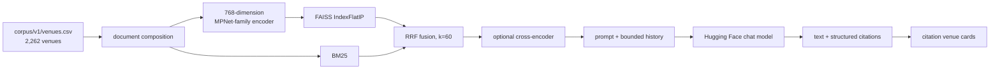

# Urban Gala

Urban Gala is a Manhattan venue-discovery and itinerary application built with
React, Spring Boot, Flask, MySQL, and local ML artifacts. Users can search by
natural-language “vibe,” inspect predicted busyness, plan routes, save and share
plans with friends, and ask a retrieval-grounded AI concierge for venue
recommendations.

## Verified capabilities

- Browse a canonical catalog of 2,262 Manhattan venues.
- View current-time busyness predictions and a 12-hour forecast.
- Search venues using normalized FAISS dense retrieval with zone and price
  filters.
- Use BM25+dense hybrid retrieval through Reciprocal Rank Fusion.
- Ask an AI concierge that receives retrieved venue context and returns
  structured citation records.
- Continue conversations with bounded prior questions and responses.
- Hydrate cited venues into frontend cards and add them to an itinerary.
- Request walking or transit routes through Google Routes, with route
  normalization, segment caching, and fallback polylines.
- Create, edit, save, and share plans with selected users/friends.
- Manage favorites, friends, profiles, and avatars through JWT-authenticated
  APIs.

“Current” or “live” busyness is model inference for the current time and
available weather inputs. It is not sensor-based live occupancy.

## Architecture

| Service | Responsibility |
|---------|----------------|
| `frontend` | React/Vite interface; production bundle served by Nginx |
| `backend` | Spring API for auth, users, venues, plans, favorites, friends, routing coordination, caching, and service contracts |
| `llm-service` | Flask/Gunicorn service for FAISS, BM25, RAG orchestration, citations, evaluation, and metrics |
| `busyness-service` | Flask service for Keras DNN/LSTM prediction, forecasts, artifact verification, and bounded caches |
| `db` | MySQL schema managed by Flyway and validated by Hibernate |

### RAG path



The cross-encoder is enabled (`CROSS_ENCODER_ENABLED=true`): on the 96-question
benchmark it adds ~63 ms at p50 for +0.056 Recall@5 and +0.050 NDCG@5. The
`jev` runtime then layers three Jev decisions on top of retrieval: a
pre-retrieval **scope cap** (declines off-topic and harmful messages before
retrieval), **calibrated abstention** for out-of-catalog requests, and a
**faithfulness guardrail** that replaces fabricated answers or appends a caveat.
Runtime Jev query analysis and Jev re-ranking are disabled. The cross-encoder
also receives canonical `Area:` labels so sub-zones such as Lenox Hill are
recognised as the Upper East Side. See [Jev Integration](JEV_INTEGRATION.md) and
[Cross-Encoder Re-Ranking Trade-off](CROSS_ENCODER_TRADEOFF.md).

The generative LLM runs through the Hugging Face chat-completions API. It is not
hosted locally by this repository.

## Evaluation

The offline retrieval harness uses a 96-question benchmark across five
categories and computes Recall@5, NDCG@5, MRR, Precision@5, and Hit Rate. With
hybrid retrieval and the `jev` branch fixes, Recall@5 is 0.4988 without
re-ranking and 0.5545 with the cross-encoder; hit rate is 0.7292 and 0.8021
respectively.

These results are directional measurements on a small internal benchmark, not a
claim of production relevance quality. See
[Jev Integration](JEV_INTEGRATION.md#measurements) for the full tables and
caveats.

## Documentation

| Document | Purpose |
|----------|---------|
| [Testing](TESTING.md) | Current test inventory and the latest observed results |
| [Security](SECURITY.md) | Implemented controls, operator responsibilities, and explicit non-capabilities |
| [Evaluation Strategy](EVALUATION_STRATEGY.md) | Retrieval benchmark, metrics, interpretation, and remaining evaluation work |
| [Jev Integration](JEV_INTEGRATION.md) | Jev scope cap, abstention, guardrail, retrieval/busyness fixes, and A/B results |
| [Jev → v2 Merge Notes](jev-merge-notes.md) | What to carry into `urban-gala-v2`, what to leave behind, and the validation checklist |
| [Cross-Encoder Trade-off](CROSS_ENCODER_TRADEOFF.md) | Cross-encoder quality/latency measurements and why it is enabled |
| [Artifact Policy](artifacts.md) | Git LFS ownership, checksums, corpus and model artifacts |
| [Index Pipeline](index-pipeline.md) | Building and validating FAISS/BM25 indexes |
| [LLM Runtime](llm-runtime.md) | Gunicorn, memory, index loading, metrics, operator commands, and `jev` vs `urban-gala-v2` sidecar compare |
| [Contract Fixtures](../BackEnd/contract-fixtures/README.md) | Flask/Spring and chat payload contracts |

Files under `Organisation/` and `ModelExplain.ipynb` are historical project
artifacts. Model-directory READMEs are upstream model cards.

## Requirements

- Docker Desktop with Compose
- Git LFS
- A populated root `.env`, based on `env.example`
- Google Routes credentials for route functionality
- A Hugging Face token for generated chat responses

Required production secrets include:

```text
MYSQL_ROOT_PASSWORD
MYSQL_PASSWORD
APP_JWT_SECRET
HF_TOKEN
VITE_GOOGLE_API_KEY
```

The browser-visible Google key must be restricted by HTTP referrer and API in
Google Cloud Console. See [SECURITY.md](SECURITY.md).

## Start the stack

```bash
git lfs install
git lfs pull
cp env.example .env
./scripts/verify-artifacts.sh
docker compose up --build
```

Default host endpoints:

| Endpoint | Address |
|----------|---------|
| Frontend development service | `http://localhost:5173` |
| Spring API | `http://localhost:8080` |
| `jev` llm-service (host) | `http://localhost:5002` |
| `urban-gala-v2` llm-service sidecar | `http://localhost:5001` |
| option-1 llm-service sidecar (query analysis off, cap on) | `http://localhost:5003` |
| MySQL host mapping | `localhost:3307` |
| Production Nginx profile | `http://localhost:80` |

`llm-service` and `busyness-service` are on the compose network. The `jev`
service is also published on host port `5002` (macOS Control Center already
binds `:5000`). Start the v2 sidecar with
`docker compose -p urban-gala-v2 -f docker-compose.v2-sidecar.yml up -d --build`.
See [LLM Runtime](llm-runtime.md#side-by-side-compare-jev-vs-urban-gala-v2).

Use `docker compose exec` for in-network health probes.

```bash
docker compose exec llm-service curl -f http://localhost:5000/health
docker compose exec busyness-service curl -f http://localhost:5000/health
```

Reset the development database when migrations or baseline data change:

```bash
docker compose down -v
docker compose up -d db backend
```

## Verification

Run individual suites:

```bash
cd BackEnd && ./mvnw test
cd frontend && npm test -- --run
cd BackEnd/llm-service && PYTHONPATH=. python3 -m pytest tests/ -q
cd BackEnd/busyness-service && PYTHONPATH=. python3 -m pytest tests/ -q
```

Run the production-style smoke check when Docker is available:

```bash
bash scripts/compose-smoke.sh --teardown
```

As of 2026-09-23 on the `jev` branch, the LLM pytest suite passes
(562 passed, 32 skipped) and the busyness suite passes (20 passed, 1 skipped).
The full inventory and the Spring/frontend results are recorded in
[TESTING.md](TESTING.md).

## Operational qualifications

- All caches are process-local, JVM-local, or browser-local; there is no Redis.
- Spring rate limits are per JVM and reset on restart.
- TLS termination, MySQL TLS, CSP headers, non-root containers, and distributed
  rate limiting are not implemented in this repository.
- The Nginx production bundle emits a large-chunk warning; code splitting is a
  remaining optimization.
- Prometheus metrics and a provisioned Grafana dashboard are included in the
  current v2 Compose configuration.
- Plans are shared with selected users, not through public shareable links.
