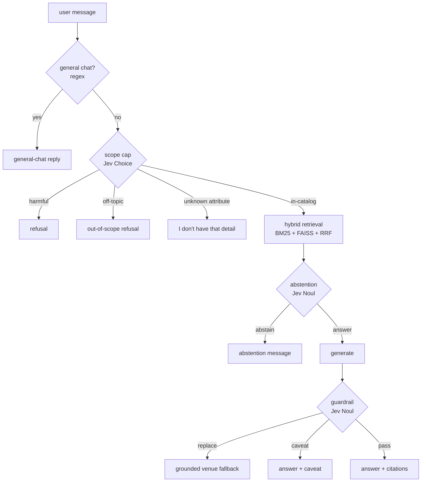

# Jev (TypeSafe System One) Integration

Status: **landed on the `jev` branch.** The deployed runtime is "option 1":
runtime Jev query analysis is **off**; the **scope cap**, **calibrated
abstention**, and **faithfulness guardrail** are **on**; the HF `rewrite_query`
call is **off**. Jev re-ranking stays behind a flag and is not used.

This document is the source of truth for how the AI Concierge RAG pipeline uses
[TypeSafe System One / Jev](https://docs.typesafe.ai/introduction), what was
measured, and what to carry into `urban-gala-v2`. The actionable merge list
lives in [jev-merge-notes.md](jev-merge-notes.md).

## Why (and the honest scorecard)

Jev returns *typed, calibrated decisions* (Choice / Score / Noul) instead of
free text. The retrieval core (MPNet + FAISS + BM25 + RRF) is strong; Jev is
used only where a decision benefits from calibration.

| Jev piece | Measured effect | Cost/turn | Used? |
|---|---|---|---|
| Scope cap (`classify_scope`) | declines 15/18 out-of-catalog, blocks abusive/prompt-injection input before retrieval | ~0.7 s | **yes** |
| Calibrated abstention (`assess_answerability`) | 15/18, same as the raw `similarity < 0.3` baseline | ~0.8 s | **yes** (safety) |
| Faithfulness guardrail (`verify_answer`) | controlled A/B: faithfulness +0.020, relevancy −0.008, 5 fabricated venues replaced | ~0.7 s | **yes** |
| Query understanding (`analyze_query`) | *worse* than plain `expand_query` (0.477 vs 0.495 Recall@5) and caused a zone-filter regression | ~0.8 s | **no** |
| Jev re-ranking (`rerank`) | ties the cross-encoder, 8–15× slower | — | **no** |
| Eval judge (`judge_answer`) | offline judge that works without HF credits | offline | harness only |

The pipeline's real quality gains on this branch came from **hybrid retrieval**
and three **retrieval bug fixes** (see below), not from Jev. Jev earns its place
through the scope cap, abstention, and guardrail.

## Configuration

| Env var | Default | Purpose |
|---|---|---|
| `TYPESAFE_API_KEY` | *(empty)* | Key from https://console.typesafe.ai/keys |
| `JEV_ENABLED` | `false` | Master switch. When false, nothing changes. |
| `JEV_MODEL` | `jev-latest` | Model alias |
| `TYPESAFE_API_URL` | `https://api.typesafe.ai/v1/systemone` | Endpoint override |
| `JEV_TIMEOUT_SECONDS` | `8` | Per-request timeout |
| `JEV_MAX_RETRIES` | `2` | Retries for 429/529 + transient errors |
| `JEV_CONFIDENCE_THRESHOLD` | `0.5` | Below this, a query-analysis answer is "no signal" |
| `JEV_QUERY_ANALYSIS_ENABLED` | `true` | Runtime query understanding. **Set false for option 1.** |
| `JEV_ABSTENTION_ENABLED` | `true` | Calibrated abstention (needs `JEV_ENABLED`) |
| `JEV_ABSTENTION_THRESHOLD` | `0.5` | Abstain when P(answerable) < t or P(out_of_scope) ≥ t |
| `JEV_GUARDRAIL_ENABLED` | `true` | Runtime faithfulness guardrail (needs `JEV_ENABLED`) |
| `JEV_GUARDRAIL_REPLACE_THRESHOLD` | `0.8` | Replace at/above this unsupported-detail probability |
| `JEV_GUARDRAIL_CAVEAT_THRESHOLD` | `0.5` | Caveat at/above this probability |
| `CHAT_SCOPE_GATE_ENABLED` | `false` (Compose `true`) | Pre-retrieval out-of-scope/abuse cap |
| `CHAT_SCOPE_OFFTOPIC_THRESHOLD` | `0.4` | Min Choice confidence to act on off-topic / unknown-attribute |
| `CHAT_SCOPE_HARMFUL_THRESHOLD` | `0.5` | Min Choice confidence to act on harmful |
| `JEV_RERANK_ENABLED` | `false` | Jev re-ranking (not used) |
| `JEV_SEARCH_COMPOSE_ENABLED` | `false` | Append Jev terms to the query (not used) |
| `HF_QUERY_REWRITE_ENABLED` | `true` | HF `rewrite_query`. **Set false for option 1.** |

Runtime behaviour when a call is disabled, times out, or is malformed: the
pipeline falls back to its previous behaviour. Every entry point returns `None`
rather than raising.

## Runtime pipeline



### 1. Scope cap (pre-retrieval)

`jev_service.classify_scope` asks one 3-way **Choice** (`build_scope_questions`):

- `in_catalog` — Manhattan venue/nightlife request, or app help
- `off_topic` — other city/borough, non-venue service, city-wide event calendar, general knowledge, personal task
- `in_catalog_unknown_attribute` — a specific detail about a **named** catalog venue that the catalog does not store (hours, phone, capacity, dress code, cover charge, minimum spend, social following, live schedule)
- `harmful` — harmful/illegal/hateful/sexual/abusive, or an instruction-override (prompt injection)

`chat_service.resolve_scope_decision` adds a deterministic **follow-up rule**:
if the classifier says `off_topic` but the query names a catalog venue
(`_query_mentions_known_venue`), it is upgraded to
`decline_unknown_attribute`. This is what makes "what is the capacity of
Pianos?" reliably answer with *"I don't have that detail…"* instead of the
generic refusal.

Declines return one of `OUT_OF_SCOPE_MESSAGE`, `UNKNOWN_ATTRIBUTE_MESSAGE`, or
`HARMFUL_SCOPE_MESSAGE`, with **zero citations** and no retrieval or
generation. The gate **fails open**: a Jev outage never blocks chat.

A 4-label Choice was chosen over Nouls deliberately: a long negated Noul
("answer false for other topics…") collapsed real venue queries to ~0.2 P(true)
(40 false declines), and a short Noul accepted "restaurants in Los Angeles".
See `scripts/scope_probe.py` and [results](#scope-cap-calibration).

### 2. Calibrated abstention (post-retrieval)

`resolve_answerability` asks two Nouls (`answerable`, `out_of_scope`) over the
retrieved candidates. On abstention the response is `ABSTENTION_MESSAGE` with no
citations. This is the mechanism for in-catalog-but-unsatisfiable requests
("karate bars with private rooms for 20") that the scope cap must not decline.

### 3. Faithfulness guardrail (post-generation)

`resolve_answer_verification` asks three Nouls (`faithful`, `fabricated_venue`,
`unsupported_detail`) over the answer plus retrieved context:

- **replace** (fabricated venue or severe unsupported detail) → swap for the
  grounded venue list (`build_retrieval_fallback_response`).
- **caveat** → keep the answer and append `UNVERIFIED_CAVEAT`.
- **pass** → unchanged.

### 4. Jev re-ranking — available, not used

`rerank` scores each candidate in one parallel call. It matches the
cross-encoder's quality but is 8–15× slower, so `JEV_RERANK_ENABLED=false`. See
[CROSS_ENCODER_TRADEOFF.md](CROSS_ENCODER_TRADEOFF.md).

### 5. Eval judge — offline only

`judge_answer` mirrors `prompts/judge-v1.yaml` with three Score questions. It is
the judge fallback when HF inference credits run out and the judge used by the
controlled A/B scripts. It is not on the serving path.

## Retrieval fixes that shipped on this branch

These matter more than Jev for retrieval quality:

1. **Micro-zone → macro-zone filter** (`search_service.location_filter_group_terms`).
   Jev's zone list contains corpus micro-zones (`upper east side south`,
   `lenox hill west`). The filter previously treated them literally and
   excluded the rest of the Upper East Side. `_matches_location_filter` now
   expands a micro-zone to its group.
2. **Reranker zone labels** (`canonical_area_labels`, `compose_rerank_text`).
   The cross-encoder judged `Zone: Lenox Hill West` as "not the Upper East
   Side" and down-ranked Maya/Tacombi below UES-labelled Italian venues. The
   rerank text now appends `Area: Upper East Side` for grouped micro-zones
   (reranker only — no re-embedding).
3. **Filter-before-rerank** (`_hybrid_collect`, `_dense_collect`). Candidates are
   now location/price-filtered **before** the cross-encoder, and the hybrid
   fetch window grows until enough in-filter candidates exist. Previously a
   small global top-K was re-ranked, most of it was filtered away, and a few
   in-zone venues filled the result set before deeper matches were scored.
4. **Normalized fusion in the expansion pass.** The hybrid expansion path
   re-fused raw BM25/dense scores while the initial pass normalized them; the
   method is now a single normalized loop.

## Busyness integration fixes

1. **Timeout.** The busyness service runs every DNN + the LSTM (~6 s cold) but
   the LLM fetch timeout was 5 s, so the first request after each cache expiry
   was discarded and chat reported busyness as unavailable.
   `BUSYNESS_FETCH_TIMEOUT_SECONDS` now defaults to `15`.
2. **Service warmup.** The busyness service warms its own cache at startup and
   every `BUSYNESS_WARM_REFRESH_SECONDS` (default 900 s), so the cold compute is
   never on the request path (observed 7.1 s cold → 0.0 s warm).
3. **Readable context.** The chat context now maps numeric zone IDs to
   neighbourhood names (`data/zone_names.json`, generated from
   `manhattanZones.geojson`) and includes the requested area's hourly forecast.

## Measurements

### Retrieval — 96 questions, hybrid, with the fixes

`scripts/rerank_bench.py`:

| Strategy | p50 | p95 | Recall@5 | NDCG@5 | Hit Rate |
|---|---|---|---|---|---|
| none | 25.7 ms | 31.9 ms | 0.4988 | 0.5077 | 0.7292 |
| cross-encoder | 89.1 ms | 106.6 ms | **0.5545** | **0.5576** | **0.8021** |
| Jev rerank (48 q) | 754 ms | 939 ms | 0.5382 | 0.5618 | 0.8333 |

Cross-encoder cost: **+63 ms p50** for **+0.056 Recall / +0.050 NDCG / +7.3 pp
hit rate**. Jev rerank is not competitive on latency.

### Query resolution — 96 questions

`scripts/query_rewrite_ab.py`:

| Resolution | Recall@5 | NDCG@5 | Hit Rate | Query ms |
|---|---|---|---|---|
| static `expand` | **0.4950** | 0.4966 | 0.6667 | **57** |
| raw | 0.4899 | 0.4984 | 0.6771 | 97 |
| Jev compose + expand | 0.4774 | 0.4871 | 0.6562 | 758 |
| HF `rewrite_query` + expand | 0.4137 | 0.4091 | 0.5521 | 1027 |

The HF rewrite hurts retrieval and costs ~1 s, so it is removed when a Jev
analysis is present and, in option 1, on the regex path too. Jev composition is
also skipped.

### Scope cap calibration

`scripts/scope_probe.py` (96 benchmark questions + 18 probes), threshold `0.4`:

| Input set | Result |
|---|---|
| retrieval / filtered / conversational (60) | 60/60 allow |
| adversarial (18) | 14 unknown-attribute declined, 4 answerable allowed |
| abstention (18) | 15 off-topic declined, 3 attribute-level allowed |
| off-topic probes (6) | 6/6 declined |
| harmful / injection probes (7) | 7/7 refused (6 harmful, 1 off-topic) |
| **off-topic/harmful allowed through** | **0** |

False declines on the 96 benchmark questions: **0**. The only declines outside
the intended sets are `hi there` / `what can you do?` probes, which the
general-chat branch handles before the scope gate.

### Guardrail — controlled A/B, 96 questions

`scripts/guardrail_ab.py` generates each answer once at temperature 0 and
applies every policy to the same answers:

| Policy | Faithfulness | Relevancy | Context precision | Actions |
|---|---|---|---|---|
| none | 0.3729 | **0.7180** | 0.6079 | 96 pass |
| v1 replace-any | **0.4513** | 0.6440 | **0.6185** | 36 replace |
| **tiered (shipped)** | 0.3924 | 0.7105 | 0.6109 | 5 replace + 31 caveat |

### Abstention

15/18 abstention questions, identical to the raw `similarity < 0.3` baseline,
with ~1.3% over-abstention on legitimate queries. Kept for out-of-catalog
safety rather than measured quality.

### Pipeline A/B — jev vs option 1, generation fixed

`scripts/pipeline_ab.py`, 96 questions, answer generated once and replayed
through both decision layers:

| Arm | pass | caveat | abstain | replace | Faithfulness | Relevancy |
|---|---|---|---|---|---|---|
| jev | 49 | 29 | 16 | 2 | 0.3633 | 0.6666 |
| **option 1** | 56 | 36 | 0 | 4 | **0.3829** | **0.7276** |

With the retrieval fixes, option 1 dominates on the judge's metrics. The whole
gap is the abstention message, which scores a fixed ~0.16 relevancy — the judge
has no "should have abstained" dimension, so this is a helpfulness result, not
a safety result. Abstention is therefore kept for out-of-catalog requests.

## Running the harnesses

```bash
cd BackEnd/llm-service
export TYPESAFE_API_KEY=ts_...
export HF_TOKEN=hf_...

# retrieval quality + latency (no Jev needed)
CROSS_ENCODER_ENABLED=true PYTHONPATH=. python3 scripts/rerank_bench.py --label ce --report reports/rerank-ce.json
CROSS_ENCODER_ENABLED=false PYTHONPATH=. python3 scripts/rerank_bench.py --label none

# scope cap confusion matrix
PYTHONPATH=. python3 scripts/scope_probe.py --report reports/scope-probe.json

# controlled guardrail / pipeline A/B (needs Jev + HF)
JEV_ENABLED=true PYTHONPATH=. python3 scripts/guardrail_ab.py --report reports/guardrail-ab.json
PYTHONPATH=. python3 scripts/pipeline_ab.py --report reports/pipeline-ab-fixed.json

# query-resolution A/B
PYTHONPATH=. python3 scripts/query_rewrite_ab.py
```

Unit tests (no network):

```bash
cd BackEnd/llm-service
PYTHONPATH=. python3 -m pytest tests/ -q
```

## Next steps

1. **Merge into `urban-gala-v2`** — follow [jev-merge-notes.md](jev-merge-notes.md).
2. **Scope label tuning** — `in_catalog_unknown_attribute` vs `off_topic` is
   still model-nondeterministic for borderline venue-detail questions; the
   deterministic follow-up rule covers the gap.
3. **Conversational reformulation** — `reformulate_query` still makes an HF call
   per multi-turn follow-up; a small Jev Choice could absorb it.
