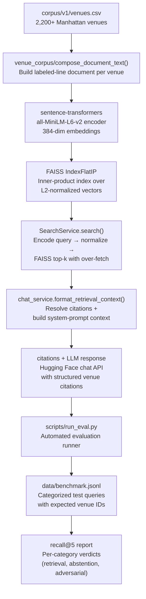

# Urban Gala

Urban Gala is a full-stack web application that helps users discover, compare, and plan visits to Manhattan venues using trustworthy busyness and location intelligence. It combines real-time crowd predictions, semantic vector search (FAISS), walking/transit directions, itinerary planning, and an LLM-powered chatbot into a single React + Spring Boot + Flask platform.

## Key Features

-   **Interactive Map:** Browse 2,200+ Manhattan venues on a live map with real-time busyness heatmaps and 12-hour forecasts.
-   **Find My Vibe:** Use natural language to search venues by atmosphere (e.g., "a quiet coffee shop in Greenwich Village"). Powered by FAISS vector similarity search over sentence-transformer embeddings.
-   **AI Chatbot:** Conversational venue discovery with cited responses — chat with the LLM to get personalized recommendations informed by real venue data.
-   **Walking & Transit Directions:** Multi-stop route planning via Google Routes API with turn-by-turn directions, distance, and duration.
-   **Itinerary Planning:** Create, edit, share, and save custom outing plans. Share plans with friends via a shareable link.
-   **Favorites & Friends:** Save favorite venues, manage a friends list, view friends' favorites, and see shared plans.
-   **User Authentication & Profiles:** Sign up, log in, upload an avatar, manage your profile. JWT-based stateless auth with rate limiting on expensive endpoints.

## Architecture Overview

The application is built on a microservice architecture, orchestrated with Docker Compose.

-   **`frontend`**: A React application built with Vite, using Material-UI. Production builds served via Nginx.
-   **`backend`**: A Java Spring Boot application that serves as the main API gateway, handling authentication, plans, favorites, friends, locations, and core business logic. Includes in-memory Caffeine caching with per-cache TTL/size limits.
-   **`llm-service`**: A Python 3.11 Flask microservice (Gunicorn, 2 workers, preload) that handles:
    -   FAISS vector similarity search for "Find My Vibe" (index built at startup from committed embeddings).
    -   AI Chatbot orchestration via Hugging Face API with conversation history.
    -   In-process bounded TTL cache for search results.
-   **`busyness-service`**: A Python Flask microservice that predicts and serves location busyness levels using Keras DNN and LSTM models. Includes startup checksum verification, process-local TTL caches, and weather-fallback forecast generation.
-   **`db`**: A MySQL database with Flyway schema migrations and CSV-based venue data import.

## RAG Pipeline Architecture

The "Find My Vibe" semantic search and AI Chatbot features are powered by a Retrieval-Augmented Generation (RAG) pipeline. The diagram below shows how venue data flows from raw CSV through embedding, indexing, retrieval, chat response generation, and offline evaluation.



**Pipeline stages:**

1. **Corpus ingestion** — `corpus/v1/venues.csv` is the versioned venue catalog. Each row contains name, description, zone, price, type, tags, and other attributes.
2. **Document composition** — `venue_corpus.compose_document_text()` converts each CSV row into a labeled-line text document (e.g. `Name: ...\nDescription: ...\nZone: ...`), skipping empty/NA fields.
3. **Embedding** — A `sentence-transformers` model (`all-MiniLM-L6-v2`, 384 dimensions) encodes every document into a dense float32 vector. The model is stored under `BackEnd/llm-service/models/` (Git LFS).
4. **Vector indexing** — `search_service.build_vector_index()` L2-normalizes all embeddings and builds an in-memory `faiss.IndexFlatIP` for exact inner-product similarity search. A persisted index (`faiss.index` + `metadata.json`) is preferred when available; otherwise the index is built fresh from `.npy` embeddings at startup.
5. **Semantic search** — `SearchService.search()` encodes the user query with the same model, normalizes it, and queries the FAISS index with an over-fetch multiplier to compensate for post-filtering (location zone, price range, exclusions).
6. **Retrieval context assembly** — `chat_service.format_retrieval_context()` converts the ranked result DTOs into (a) a natural-language context string listing venue names, zones, and types, and (b) a structured citations list with `venue_id`, `name`, `snippet`, and `score`.
7. **LLM response** — `chat_service.build_chat_messages()` assembles the system prompt (including retrieval context) and user message (including truncated chat history), then calls the Hugging Face chat completions API. The response is returned alongside the structured citations for frontend display.
8. **Offline evaluation** — `scripts/run_eval.py` loads `data/benchmark.jsonl` (categorized test queries with expected venue IDs), runs each query through the live `SearchService`, computes recall@5 and citation accuracy, and outputs a structured report with per-category verdicts (pass/fail) against configurable thresholds.

---

## Documentation Index

| Document | Purpose |
|----------|---------|
| [Artifact Policy](artifacts.md) | Runtime model artifacts, Git LFS ownership, SHA-256 checksum table, path expectations |
| [Baseline Verification](baseline-verification.md) | Tiered verification matrix, smoke checks, per-phase verification gates |
| [Cache Inventory](cache-inventory.md) | All JVM, Python, and browser caches with TTL, size limits, and invalidation paths |
| [LLM Runtime](llm-runtime.md) | Gunicorn configuration, memory measurements, FAISS index policy, operator commands |
| [Security](SECURITY.md) | Secrets management, rotation runbooks, JWT auth, CORS, rate limiting, Google API key restrictions |
| [Testing](TESTING.md) | Test suite overview: backend (25 Java files), frontend (11 Vitest files), Python ML (14 files), Cypress E2E, compose-smoke |
| [Evaluation Strategy](EVALUATION_STRATEGY.md) | Test-driven architecture decisions, coverage metrics, ML model evaluation |

---

## Getting Started

Follow these instructions to set up and run the project locally.

### Prerequisites

-   **Docker Desktop:** Download and install. This includes Docker Compose.
-   **Git LFS:** Required for handling large model files. Install from [git-lfs.com](https://git-lfs.com).

Before starting services, read [Runtime Artifact Policy](artifacts.md) for **runtime model artifacts** — expected repository paths, ownership (Git LFS vs source-owned metadata), manual checksum verification with `scripts/verify-artifacts.sh`, busyness startup checksum enforcement, and process-local busyness cache behavior.

### 1. Clone the Repository

First, install Git LFS on your machine to ensure the machine learning models are downloaded correctly.

```bash
# Install Git LFS (once per machine)
git lfs install

# Clone the repository
git clone https://github.com/niallgiblin/team-2-COMP47360
cd team-2-COMP47360
```
*Note: If you cloned the repository before installing Git LFS, you may need to run `git lfs pull` inside the project directory to download the model files.*

After pulling LFS objects, verify runtime binaries with `./scripts/verify-artifacts.sh` (see [artifacts.md](artifacts.md) for the full manifest and checksum table).

### 2. Configure Environment Variables

The application requires API keys to function correctly. You'll need to create a `.env` file in the project root.

1.  **Create the `.env` file** by copying the example file:
    ```bash
    cp env.example .env
    ```
    See [`env.example`](../env.example) in the repository root for all supported variables, including optional local-development path overrides.

2.  **Edit the `.env` file** and add your keys:
    ```
    VITE_GOOGLE_API_KEY=AIzaSy...
    HF_TOKEN=hf_...
    APP_JWT_SECRET=your-super-secret-jwt-key-here
    ```
    -   `VITE_GOOGLE_API_KEY`: Required for Google Maps. Get a key from the Google Cloud Console. You will need to enable the "Maps JavaScript API" and the "Routes API".
    -   `HF_TOKEN`: Required for the AI Chatbot. Get a free "read" access token from your Hugging Face account settings.
    -   `APP_JWT_SECRET`: A secret key for signing authentication tokens. For production, this should be a long, random, base64-encoded string. You can generate a secure one with the following command:
        ```bash
        openssl rand -base64 32
        ```

### 3. Build and Run the Application

With Docker Desktop running, start all services using Docker Compose.

```bash
docker-compose up --build
```

**First time running?** This will take a few minutes as Docker downloads and builds all the necessary components.

### 3. Wait for Startup
You'll see lots of log messages. Wait until you see these key messages:
- `urban-gala-db: ready for connections`
- `urban-gala-backend: Started BusynessPredictorApplication`
- `urban-gala-frontend: Local: http://localhost:5173/`

### 4. Access the Application
Once everything is running:
- **Frontend (Web App):** http://localhost:5173
- **Backend API:** http://localhost:8080
- **LLM Service:** `docker compose exec llm-service curl http://localhost:5000/health` (internal only)
- **Busyness Service:** `docker compose exec busyness-service curl http://localhost:5000/health` (internal only)

### Reset database schema (development)

When Flyway baseline or migrations change, reset the MySQL volume and restart:

```bash
docker compose down -v
docker compose up -d db backend
```

Flyway applies migrations on backend startup; Hibernate uses `ddl-auto=validate`.

### Production Smoke Check

Verify the full production-like stack with one command:

```bash
bash scripts/compose-smoke.sh --teardown
```

Brings up the prod profile (Nginx static frontend), waits for all services to become healthy, then verifies Spring Actuator, LLM health, busyness health, static Nginx serving, and proxied API routing. See [baseline-verification.md](baseline-verification.md) for the full smoke gate specification.

## Common Docker Commands

### Starting the Application
```zsh
# Start in foreground (see all logs)
docker-compose up

# Start in background (detached mode)
docker-compose up -d

# Force rebuild containers
docker-compose up --build
```

### Stopping the Application
```zsh
# Stop all containers
docker-compose down

# Stop and remove all data (fresh start).
# Use this if you have issues with database initialization or want a clean slate.
docker-compose down -v
```

### Viewing Logs
```zsh
# View logs from all services
docker-compose logs

# View logs from specific service
docker-compose logs backend
docker-compose logs frontend
docker-compose logs db

# Follow logs in real-time
docker-compose logs -f
```

### Checking Container Status
```zsh
# See running containers
docker ps

# See all containers (running and stopped)
docker ps -a
```

## Evaluation Results

The RAG pipeline is evaluated against a curated benchmark of **41 questions** across **5 categories**, executed automatically via `scripts/run_eval.py`. The benchmark measures recall@5 and citation accuracy with category-specific thresholds.

| Category | Questions | Description | Threshold |
|----------|-----------|-------------|-----------|
| Retrieval | 9 | Open-ended semantic queries (jazz clubs, rooftop bars, museums, etc.) | recall@5 ≥ 0.60 |
| Filtered | 8 | Zone- and price-filtered searches (East Village bars, Chinatown budget eats, etc.) | recall@5 ≥ 0.60 |
| Conversational | 8 | Context-dependent follow-ups ("cheaper options?", "anything in East Village instead?") | recall@5 ≥ 0.60 |
| Adversarial | 8 | Queries targeting out-of-corpus attributes (hours, phone numbers, dress codes, ratings) | citation accuracy |
| Abstention | 8 | Out-of-domain queries (Chicago pizza, dentists, hotels, hiking) — system should return nothing | ≥ 70% pass rate |

**Eval runner capabilities** (`scripts/run_eval.py`):

- Loads any benchmark JSONL (default: `data/benchmark.jsonl`) and executes every question through the live `SearchService` against the FAISS index.
- Computes recall@5 for retrieval, filtered, and conversational categories and enforces category-level pass/fail thresholds.
- For adversarial questions, validates that citations are well-formed and traceable to retrieved results — no fabricated attributes.
- For abstention questions, verifies the system returns no results or only low-similarity results (< 0.3).
- Produces a structured console report with per-category verdicts and an optional JSON report (`--report`).
- Exits 0 when all categories meet their thresholds, exits 1 on any breach.

The eval harness itself is covered by **30 unit and integration tests** (`tests/test_eval.py`), covering pure-function recall computation, citation accuracy checking, CLI argument parsing, benchmark schema validation, abstention detection, filtered-search parameter passthrough, threshold enforcement, JSON report structure, and a mini-benchmark integration smoke test — all passing.

## Portfolio Summary

Urban Gala's RAG pipeline brings retrieval-augmented generation to Manhattan venue discovery. Over a single milestone, we built a versioned 2,200+-venue corpus, a FAISS inner-product vector index over sentence-transformer embeddings, a unified retrieval service with zone and price filtering, grounded LLM citations, and an automated evaluation harness covering 41 benchmark questions across 5 categories — all containerized and ready for interview demonstration.

## Troubleshooting

### Problem: "Port already in use" error
**Solution:** Another application is using the same port.
```zsh
# Stop the application
docker-compose down

# Check what's using the port
# Windows:
netstat -ano | findstr :5173
netstat -ano | findstr :8080

# Mac/Linux:
lsof -i :5173
lsof -i :8080

# Kill the conflicting processes
```

### Problem: Containers won't start
**Solution:** Clean up and rebuild:
```zsh
# Stop everything
docker-compose down -v

# Remove old images
docker system prune -a

# Rebuild and start
docker-compose up --build
```

### Problem: Database connection errors
**Solution:** Wait longer or restart the database:
```zsh
# Restart just the database
docker-compose restart db

# Or restart everything
docker-compose restart
```

### Problem: Changes to code not showing up
**Solution:** Rebuild the containers:
```zsh
docker-compose down
docker-compose up --build
```

## Project Structure

```
team-2-COMP47360/
├── docker-compose.yml           # Defines all services (dev + prod profiles)
├── env.example                  # Template for required .env variables
├── scripts/
│   ├── compose-smoke.sh         # Production-like Docker smoke verification
│   ├── verify-artifacts.sh      # SHA-256 checksum verification for 70 runtime binaries
│   ├── run-tests.sh             # Unified test runner (Maven + Vitest + Cypress)
│   └── check-tests.sh           # Quick test status check
├── docs/                        # Project documentation (see index above)
├── frontend/
│   ├── Dockerfile               # Multi-stage build (Vite → Nginx for prod)
│   ├── nginx.conf               # Nginx reverse proxy config (chat, API, avatars)
│   ├── cypress/                 # Cypress E2E test suites
│   └── src/
│       ├── pages/               # Page components (Home, MapView, FindMyVibe, etc.)
│       ├── components/          # Shared UI components (AIChatWidget, ForecastSlider, etc.)
│       ├── services/            # API client, auth, route, chat services
│       ├── contexts/            # React contexts (Auth, Plan, Busyness)
│       └── cache/               # Browser cache modules + invalidation hooks
├── BackEnd/
│   ├── Dockerfile               # Spring Boot container (Maven build)
│   ├── src/
│   │   ├── main/java/.../controller/  # 8 REST controllers (Auth, Vibe, Plan, etc.)
│   │   ├── main/java/.../service/    # 12 service classes with Caffeine caching
│   │   └── test/                      # 25 JUnit/MockMvc test classes
│   ├── llm-service/              # Python Flask LLM microservice
│   │   ├── app.py                # Gunicorn entry point (FAISS, search, chat)
│   │   ├── corpus/v1/            # Versioned venue catalog (venues.csv, manifest.json)
│   │   ├── data/                 # location_embeddings.npy (Git LFS)
│   │   ├── models/               # sentence-transformers model (Git LFS)
│   │   └── tests/                # 10 Python test files
│   └── busyness-service/         # Python Flask busyness microservice
│       ├── app.py                # Busyness prediction + weather fallback
│       ├── models/               # Keras DNN + LSTM models (Git LFS) + checksums.sha256
│       └── tests/                # 4 Python test files
└── config/                       # Shared configuration files
```

## Understanding the Setup

### What Docker Compose Creates:
1. **Frontend Container:** Runs the web application (Vite + React)
2. **Backend Container:** Runs the API server (Spring Boot)
3. **Database Container:** Runs MySQL database
4. **Network:** Allows containers to communicate with each other

### Default Ports:
- Frontend: `5173` (accessible at localhost:5173)
- Backend: `8080` (accessible at localhost:8080)
- Database: `3306` (internal communication only)

## Development Notes

### Backend Security:
The backend generates a temporary password on startup (shown in logs). This is normal for development.

### Daily Development:
1. Pull latest code: `git pull`
2. Start application: `docker-compose up`
3. Develop normally
4. Stop when done: `docker-compose down`

### When Dependencies or Database schema Change:
1. Stop application: `docker-compose down`
2. Rebuild: `docker-compose up --build`

---
