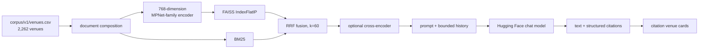

# Urban Gala

Urban Gala is a Manhattan venue-discovery and itinerary application built with
React, Spring Boot, Flask, MySQL, and local ML artifacts. Users can search by
natural-language “vibe,” inspect predicted busyness, plan routes, save and share
plans with friends, and ask a retrieval-grounded AI concierge for venue
recommendations.

For the detailed `main` versus v2 comparison and interview notes, see
[V2_UPGRADE_ANALYSIS.md](V2_UPGRADE_ANALYSIS.md).

## Verified capabilities

- Browse a canonical catalog of 2,262 Manhattan venues.
- View current-time busyness predictions and a 12-hour forecast.
- Search venues using normalized FAISS dense retrieval with zone and price
  filters.
- Use BM25+dense hybrid retrieval through Reciprocal Rank Fusion.
- Ask an AI concierge that receives retrieved venue context and returns
  structured citation records.
- Continue conversations with bounded prior questions and responses.
- Hydrate cited venues into frontend cards and add them to an itinerary.
- Request walking or transit routes through Google Routes, with route
  normalization, segment caching, and fallback polylines.
- Create, edit, save, and share plans with selected users/friends.
- Manage favorites, friends, profiles, and avatars through JWT-authenticated
  APIs.

“Current” or “live” busyness is model inference for the current time and
available weather inputs. It is not sensor-based live occupancy.

## Architecture

| Service | Responsibility |
|---------|----------------|
| `frontend` | React/Vite interface; production bundle served by Nginx |
| `backend` | Spring API for auth, users, venues, plans, favorites, friends, routing coordination, caching, and service contracts |
| `llm-service` | Flask/Gunicorn service for FAISS, BM25, RAG orchestration, citations, evaluation, and metrics |
| `busyness-service` | Flask service for Keras DNN/LSTM prediction, forecasts, artifact verification, and bounded caches |
| `db` | MySQL schema managed by Flyway and validated by Hibernate |

### RAG path


```mermaid
flowchart LR
    A["corpus/v1/venues.csv<br/>2,262 venues"] --> B["document composition"]
    B --> C["768-dimension<br/>MPNet-family encoder"]
    C --> D["FAISS IndexFlatIP"]
    B --> E["BM25"]
    D --> F["RRF fusion, k=60"]
    E --> F
    F --> G["optional cross-encoder"]
    G --> H["prompt + bounded history"]
    H --> I["Hugging Face chat model"]
    I --> J["text + structured citations"]
    J --> K["citation venue cards"]
```

The cross-encoder implementation is optional. Python defaults it on, but the
checked-in Compose stack sets `CROSS_ENCODER_ENABLED=false`; the normal Compose
deployment therefore uses hybrid retrieval without cross-encoder re-ranking.

The generative LLM runs through the Hugging Face chat-completions API. It is not
hosted locally by this repository.

## Evaluation

The offline retrieval harness uses 41 curated questions across five categories
and computes Recall@5, NDCG@5, MRR, Precision@5, and Hit Rate. The recorded
improved configuration raised aggregate Recall@5 from 0.2495 to 0.2874 and MRR
from 0.3182 to 0.3747.

These results show directional improvement on a small internal benchmark. They
are not a claim of production relevance quality. See
[V2_UPGRADE_ANALYSIS.md](V2_UPGRADE_ANALYSIS.md#evaluation) for the full table
and caveats.

## Documentation

| Document | Purpose |
|----------|---------|
| [v2 Upgrade Analysis](V2_UPGRADE_ANALYSIS.md) | Canonical comparison, limitations, verification results, interview narrative |
| [Testing](TESTING.md) | Current test inventory and the latest observed results |
| [Security](SECURITY.md) | Implemented controls, operator responsibilities, and explicit non-capabilities |
| [Evaluation Strategy](EVALUATION_STRATEGY.md) | Retrieval benchmark, metrics, interpretation, and remaining evaluation work |
| [Artifact Policy](artifacts.md) | Git LFS ownership, checksums, corpus and model artifacts |
| [Index Pipeline](index-pipeline.md) | Building and validating FAISS/BM25 indexes |
| [LLM Runtime](llm-runtime.md) | Gunicorn, memory, index loading, metrics, and operator commands |
| [Cache Inventory](cache-inventory.md) | JVM, Python, and browser cache ownership |
| [Contract Fixtures](../BackEnd/contract-fixtures/README.md) | Flask/Spring and chat payload contracts |
| [Baseline Verification](baseline-verification.md) | Historical v0.1 phase evidence, not current status |

Files under `Organisation/` and `ModelExplain.ipynb` are historical project
artifacts. Model-directory READMEs are upstream model cards.

## Requirements

- Docker Desktop with Compose
- Git LFS
- A populated root `.env`, based on `env.example`
- Google Routes credentials for route functionality
- A Hugging Face token for generated chat responses

Required production secrets include:

```text
MYSQL_ROOT_PASSWORD
MYSQL_PASSWORD
APP_JWT_SECRET
HF_TOKEN
VITE_GOOGLE_API_KEY
```

The browser-visible Google key must be restricted by HTTP referrer and API in
Google Cloud Console. See [SECURITY.md](SECURITY.md).

## Start the stack

```bash
git lfs install
git lfs pull
cp env.example .env
./scripts/verify-artifacts.sh
docker compose up --build
```

Default host endpoints:

| Endpoint | Address |
|----------|---------|
| Frontend development service | `http://localhost:5173` |
| Spring API | `http://localhost:8080` |
| MySQL host mapping | `localhost:3307` |
| Production Nginx profile | `http://localhost:80` |

The two Flask work services are internal in the production-style topology. Use
`docker compose exec` for health probes.

```bash
docker compose exec llm-service curl -f http://localhost:5000/health
docker compose exec busyness-service curl -f http://localhost:5000/health
```

Reset the development database when migrations or baseline data change:

```bash
docker compose down -v
docker compose up -d db backend
```

## Verification

Run individual suites:

```bash
cd BackEnd && ./mvnw test
cd frontend && npm test -- --run
cd BackEnd/llm-service && PYTHONPATH=. python3 -m pytest tests/ -q
cd BackEnd/busyness-service && PYTHONPATH=. python3 -m pytest tests/ -q
```

Run the production-style smoke check when Docker is available:

```bash
bash scripts/compose-smoke.sh --teardown
```

As of 2026-06-09, frontend and busyness tests pass, while the committed v2 LLM
and Spring suites still contain failures. Do not claim a fully green test
suite. Exact results and failure classes are recorded in
[TESTING.md](TESTING.md).

## Operational qualifications

- All caches are process-local, JVM-local, or browser-local; there is no Redis.
- Spring rate limits are per JVM and reset on restart.
- TLS termination, MySQL TLS, CSP headers, non-root containers, and distributed
  rate limiting are not implemented in this repository.
- The Nginx production bundle emits a large-chunk warning; code splitting is a
  remaining optimization.
- Prometheus-compatible metrics are exposed by the LLM service, but a committed
  Prometheus/Grafana deployment is not part of v2.
- Plans are shared with selected users, not through public shareable links.

